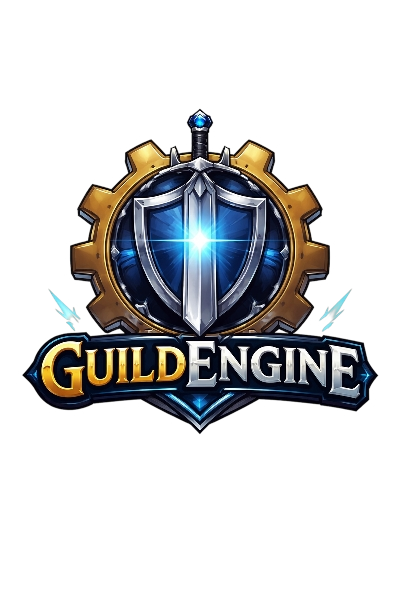

<p align="center">
  
</p>

# Guild Engine

API REST para la gestión de guilds de videojuegos. Construida con Laravel 11 y Laravel Passport.

## Requisitos

- PHP 8.3+
- Composer
- Node.js y NPM
- SQLite (por defecto) o MySQL

## Instalación

### 1. Clonar el repositorio

```bash
git clone <url-del-repo>
cd guild-engine
```

### 2. Instalar dependencias PHP

```bash
composer install
```

### 3. Configurar el entorno

```bash
cp .env.example .env
php artisan key:generate
```

Edita `.env` si querés usar MySQL en lugar de SQLite:

```env
DB_CONNECTION=mysql
DB_HOST=127.0.0.1
DB_PORT=3306
DB_DATABASE=guild_engine
DB_USERNAME=root
DB_PASSWORD=
```

### 4. Ejecutar migraciones

```bash
php artisan migrate
```

### 5. Configurar Passport

```bash
php artisan passport:install
```

Cuando pida el nombre del cliente personal, ingresá `users`:

```bash
php artisan passport:client --personal
# What should we name the personal access client? [Laravel Personal Access Client]:
# > users
```

### 6. Instalar dependencias JS y compilar assets

```bash
npm install
npm run build
```

## Levantar el servidor

**Modo producción / simple:**

```bash
php artisan serve
```

**Modo desarrollo** (servidor + queue worker + logs + Vite en paralelo):

```bash
composer run dev
```

## Tests

```bash
composer run test
```
